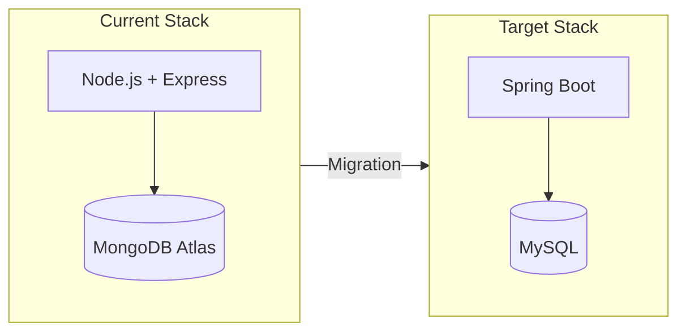
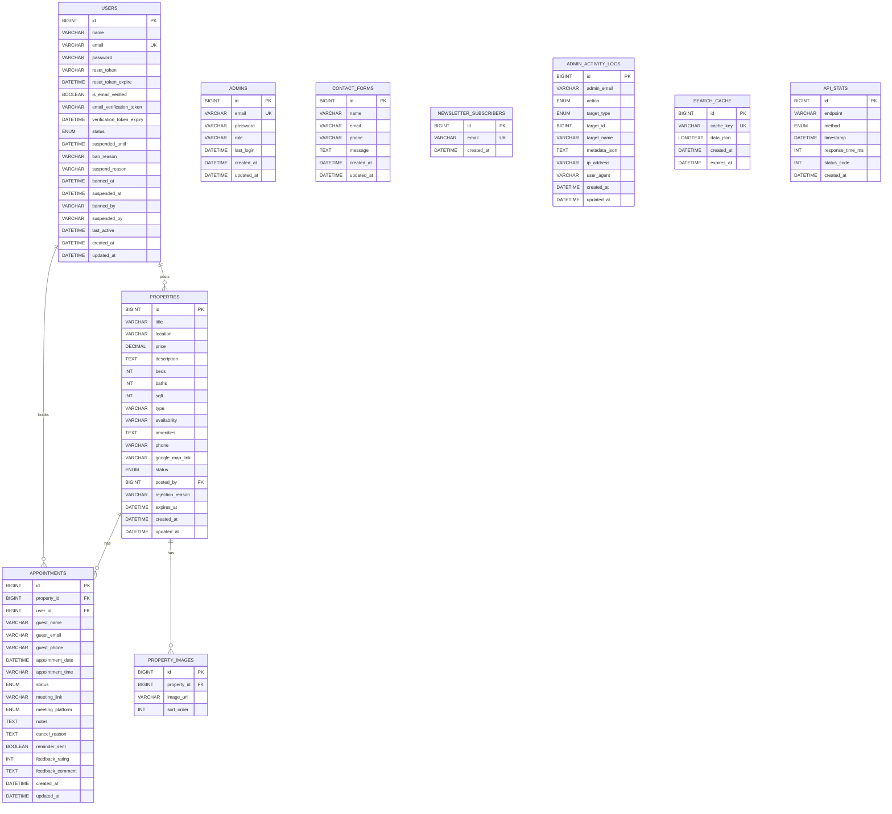
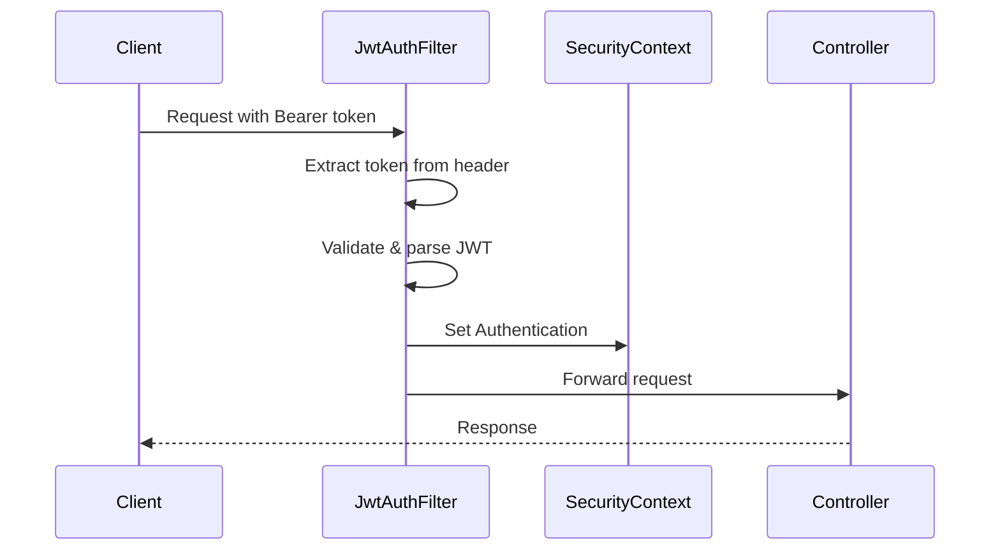
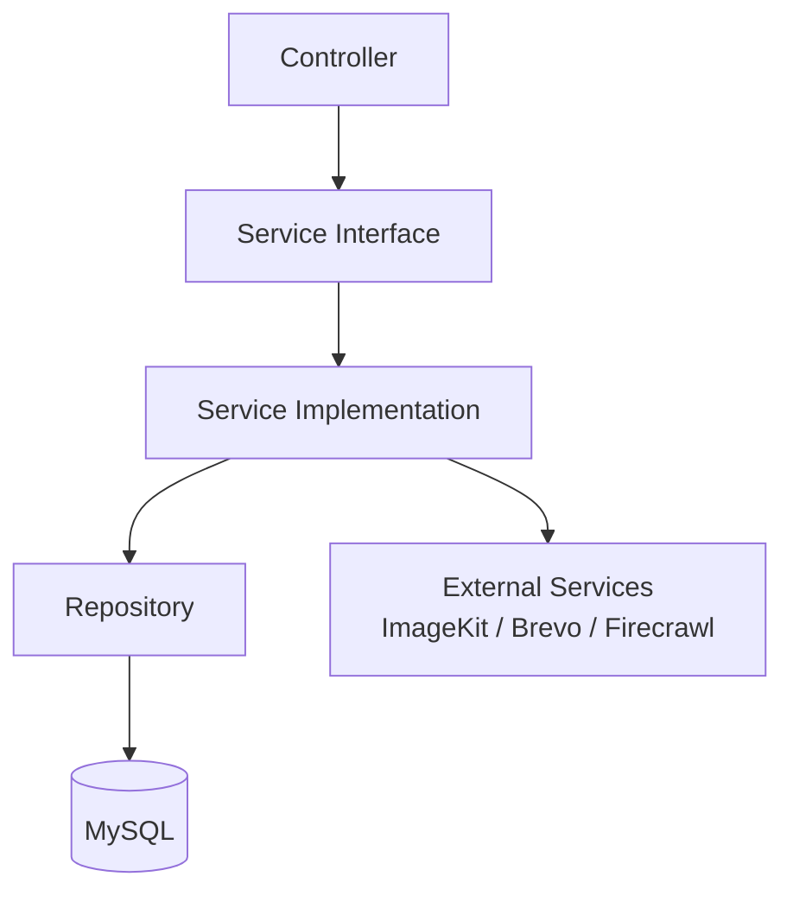
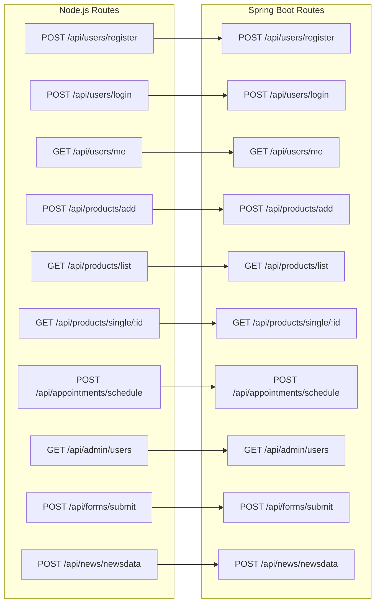
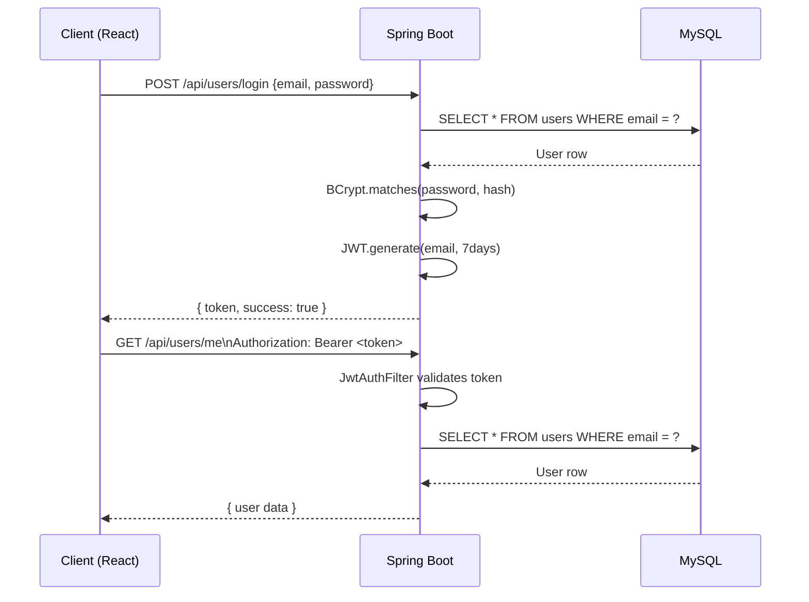
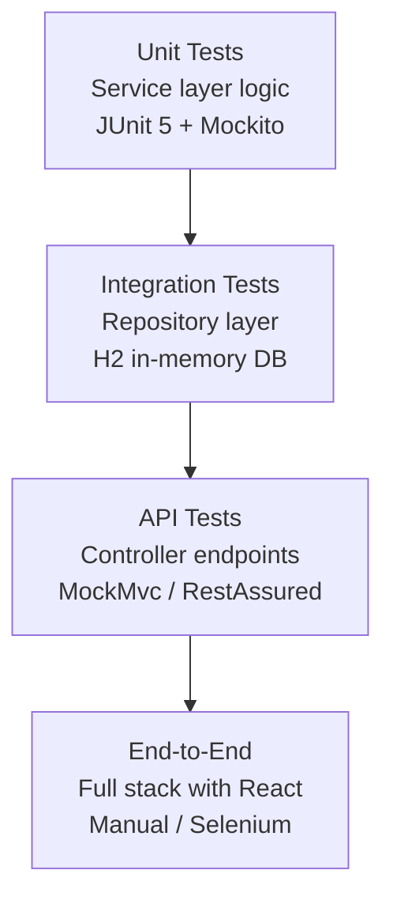
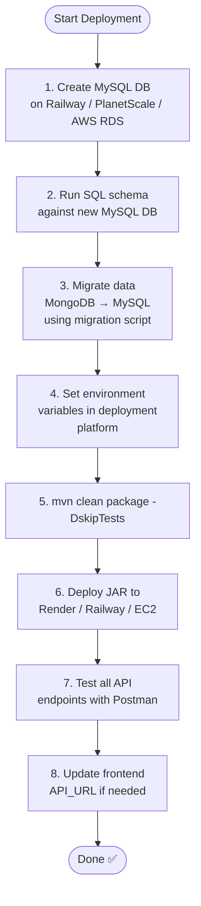
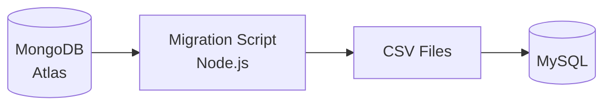

# Real Estate Backend Migration Guide
## Node.js + MongoDB → Spring Boot + MySQL

---

## Table of Contents

1. [Overview](#overview)
2. [Technology Stack Comparison](#technology-stack-comparison)
3. [Database Design (MySQL)](#database-design-mysql)
4. [Project Structure](#project-structure)
5. [Step-by-Step Migration](#step-by-step-migration)
6. [API Endpoint Mapping](#api-endpoint-mapping)
7. [Authentication Migration](#authentication-migration)
8. [File Upload (ImageKit)](#file-upload-imagekit)
9. [Email Service Migration](#email-service-migration)
10. [Background Jobs](#background-jobs)
11. [Security Configuration](#security-configuration)
12. [Environment Variables](#environment-variables)
13. [Testing Strategy](#testing-strategy)
14. [Deployment Checklist](#deployment-checklist)

---

## Overview



---

## Technology Stack Comparison

| Component | Current (Node.js) | Target (Spring Boot) |
|---|---|---|
| Runtime | Node.js 18+ | Java 17+ (LTS) |
| Framework | Express.js | Spring Boot 3.x |
| ORM | Mongoose | Spring Data JPA + Hibernate |
| Database | MongoDB Atlas | MySQL 8.x |
| Auth | JWT (jsonwebtoken) | Spring Security + JWT |
| File Upload | Multer + ImageKit | Spring Multipart + ImageKit Java SDK |
| Email | Nodemailer + Brevo | Spring Mail + Brevo REST API |
| Scheduler | node-cron | Spring `@Scheduled` |
| Logging | Winston | SLF4J + Logback |
| Rate Limiting | express-rate-limit | Bucket4j |
| Build Tool | npm | Maven or Gradle |
| Config | dotenv | application.properties / .yml |

---

## Database Design (MySQL)

### Entity Relationship Diagram



### SQL Schema

```sql
-- Users table
CREATE TABLE users (
    id BIGINT AUTO_INCREMENT PRIMARY KEY,
    name VARCHAR(255) NOT NULL,
    email VARCHAR(255) NOT NULL UNIQUE,
    password VARCHAR(255) NOT NULL,
    reset_token VARCHAR(255),
    reset_token_expire DATETIME,
    is_email_verified BOOLEAN DEFAULT FALSE,
    email_verification_token VARCHAR(255),
    verification_token_expiry DATETIME,
    status ENUM('active', 'suspended', 'banned') DEFAULT 'active',
    suspended_until DATETIME,
    ban_reason TEXT,
    suspend_reason TEXT,
    banned_at DATETIME,
    suspended_at DATETIME,
    banned_by VARCHAR(255),
    suspended_by VARCHAR(255),
    last_active DATETIME,
    created_at DATETIME DEFAULT CURRENT_TIMESTAMP,
    updated_at DATETIME DEFAULT CURRENT_TIMESTAMP ON UPDATE CURRENT_TIMESTAMP,
    INDEX idx_status (status),
    INDEX idx_email (email)
);

-- Admins table
CREATE TABLE admins (
    id BIGINT AUTO_INCREMENT PRIMARY KEY,
    email VARCHAR(255) NOT NULL UNIQUE,
    password VARCHAR(255) NOT NULL,
    role VARCHAR(50) DEFAULT 'admin',
    last_login DATETIME,
    created_at DATETIME DEFAULT CURRENT_TIMESTAMP,
    updated_at DATETIME DEFAULT CURRENT_TIMESTAMP ON UPDATE CURRENT_TIMESTAMP
);

-- Properties table
CREATE TABLE properties (
    id BIGINT AUTO_INCREMENT PRIMARY KEY,
    title VARCHAR(500) NOT NULL,
    location VARCHAR(500) NOT NULL,
    price DECIMAL(15, 2) NOT NULL,
    description TEXT NOT NULL,
    beds INT NOT NULL,
    baths INT NOT NULL,
    sqft INT NOT NULL,
    type VARCHAR(100) NOT NULL,
    availability VARCHAR(100) NOT NULL,
    amenities JSON,
    phone VARCHAR(20) NOT NULL,
    google_map_link TEXT DEFAULT '',
    status ENUM('pending', 'active', 'rejected', 'expired') DEFAULT 'active',
    posted_by BIGINT,
    rejection_reason TEXT DEFAULT '',
    expires_at DATETIME,
    created_at DATETIME DEFAULT CURRENT_TIMESTAMP,
    updated_at DATETIME DEFAULT CURRENT_TIMESTAMP ON UPDATE CURRENT_TIMESTAMP,
    FOREIGN KEY (posted_by) REFERENCES users(id) ON DELETE SET NULL,
    INDEX idx_status (status),
    INDEX idx_posted_by (posted_by),
    INDEX idx_expires_at (expires_at),
    FULLTEXT INDEX ft_search (title, location, description)
);

-- Property images table
CREATE TABLE property_images (
    id BIGINT AUTO_INCREMENT PRIMARY KEY,
    property_id BIGINT NOT NULL,
    image_url VARCHAR(1000) NOT NULL,
    sort_order INT DEFAULT 0,
    FOREIGN KEY (property_id) REFERENCES properties(id) ON DELETE CASCADE
);

-- Appointments table
CREATE TABLE appointments (
    id BIGINT AUTO_INCREMENT PRIMARY KEY,
    property_id BIGINT NOT NULL,
    user_id BIGINT,
    guest_name VARCHAR(255),
    guest_email VARCHAR(255),
    guest_phone VARCHAR(20),
    appointment_date DATETIME NOT NULL,
    appointment_time VARCHAR(20) NOT NULL,
    status ENUM('pending', 'confirmed', 'cancelled', 'completed') DEFAULT 'pending',
    meeting_link VARCHAR(1000),
    meeting_platform ENUM('zoom', 'google-meet', 'teams', 'other') DEFAULT 'other',
    notes TEXT,
    cancel_reason TEXT,
    reminder_sent BOOLEAN DEFAULT FALSE,
    feedback_rating INT CHECK (feedback_rating BETWEEN 1 AND 5),
    feedback_comment TEXT,
    created_at DATETIME DEFAULT CURRENT_TIMESTAMP,
    updated_at DATETIME DEFAULT CURRENT_TIMESTAMP ON UPDATE CURRENT_TIMESTAMP,
    FOREIGN KEY (property_id) REFERENCES properties(id) ON DELETE CASCADE,
    FOREIGN KEY (user_id) REFERENCES users(id) ON DELETE SET NULL,
    INDEX idx_user_date (user_id, appointment_date),
    INDEX idx_property_date (property_id, appointment_date),
    INDEX idx_status (status)
);

-- Contact forms table
CREATE TABLE contact_forms (
    id BIGINT AUTO_INCREMENT PRIMARY KEY,
    name VARCHAR(255) NOT NULL,
    email VARCHAR(255) NOT NULL,
    phone VARCHAR(20),
    message TEXT NOT NULL,
    created_at DATETIME DEFAULT CURRENT_TIMESTAMP,
    updated_at DATETIME DEFAULT CURRENT_TIMESTAMP ON UPDATE CURRENT_TIMESTAMP
);

-- Newsletter subscribers table
CREATE TABLE newsletter_subscribers (
    id BIGINT AUTO_INCREMENT PRIMARY KEY,
    email VARCHAR(255) NOT NULL UNIQUE,
    created_at DATETIME DEFAULT CURRENT_TIMESTAMP
);

-- Admin activity logs table
CREATE TABLE admin_activity_logs (
    id BIGINT AUTO_INCREMENT PRIMARY KEY,
    admin_email VARCHAR(255) NOT NULL,
    action ENUM(
        'approve_property','reject_property','delete_property',
        'bulk_approve_properties','bulk_reject_properties','bulk_delete_properties',
        'suspend_user','ban_user','unban_user','delete_user',
        'bulk_suspend_users','bulk_ban_users'
    ) NOT NULL,
    target_type ENUM('property', 'user', 'appointment') NOT NULL,
    target_id BIGINT,
    target_name VARCHAR(255) DEFAULT '',
    metadata_json JSON,
    ip_address VARCHAR(100) DEFAULT 'unknown',
    user_agent TEXT DEFAULT 'unknown',
    created_at DATETIME DEFAULT CURRENT_TIMESTAMP,
    updated_at DATETIME DEFAULT CURRENT_TIMESTAMP ON UPDATE CURRENT_TIMESTAMP,
    INDEX idx_admin_date (admin_email, created_at),
    INDEX idx_action_date (action, created_at),
    INDEX idx_target (target_type, target_id)
);

-- Search cache table
CREATE TABLE search_cache (
    id BIGINT AUTO_INCREMENT PRIMARY KEY,
    cache_key VARCHAR(500) NOT NULL UNIQUE,
    data_json LONGTEXT NOT NULL,
    created_at DATETIME DEFAULT CURRENT_TIMESTAMP,
    expires_at DATETIME NOT NULL,
    INDEX idx_cache_key (cache_key),
    INDEX idx_expires (expires_at)
);

-- API stats table
CREATE TABLE api_stats (
    id BIGINT AUTO_INCREMENT PRIMARY KEY,
    endpoint VARCHAR(500) NOT NULL,
    method ENUM('GET','POST','PUT','DELETE','OPTIONS','HEAD') NOT NULL,
    timestamp DATETIME DEFAULT CURRENT_TIMESTAMP,
    response_time_ms INT NOT NULL,
    status_code INT NOT NULL,
    created_at DATETIME DEFAULT CURRENT_TIMESTAMP,
    INDEX idx_endpoint_time (endpoint, timestamp),
    INDEX idx_status_code (status_code)
);
```

---

## Project Structure

```mermaid
graph TD
    ROOT[real-estate-backend/]
    ROOT --> SRC[src/main/java/com/realestate/]
    ROOT --> RES[src/main/resources/]
    ROOT --> TEST[src/test/]
    ROOT --> POM[pom.xml]

    SRC --> CONFIG[config/]
    SRC --> CTRL[controller/]
    SRC --> SVC[service/]
    SVC --> IMPL[service/impl/]
    SRC --> REPO[repository/]
    SRC --> ENTITY[entity/]
    SRC --> DTO[dto/]
    DTO --> REQ[dto/request/]
    DTO --> RESP[dto/response/]
    SRC --> SECURITY[security/]
    SRC --> MIDDLEWARE[filter/]
    SRC --> EXCEPT[exception/]
    SRC --> SCHEDULER[scheduler/]
    SRC --> UTIL[util/]

    CONFIG --> AppConfig[AppConfig.java]
    CONFIG --> SecurityConfig[SecurityConfig.java]
    CONFIG --> JwtConfig[JwtConfig.java]
    CONFIG --> ImageKitConfig[ImageKitConfig.java]
    CONFIG --> MailConfig[MailConfig.java]
    CONFIG --> CorsConfig[CorsConfig.java]

    CTRL --> UserCtrl[UserController.java]
    CTRL --> ProductCtrl[PropertyController.java]
    CTRL --> AppCtrl[AppointmentController.java]
    CTRL --> AdminCtrl[AdminController.java]
    CTRL --> FormCtrl[FormController.java]
    CTRL --> NewsCtrl[NewsController.java]
    CTRL --> HealthCtrl[HealthController.java]

    ENTITY --> UserEntity[User.java]
    ENTITY --> PropEntity[Property.java]
    ENTITY --> ApptEntity[Appointment.java]
    ENTITY --> FormEntity[ContactForm.java]
    ENTITY --> NewsEntity[NewsletterSubscriber.java]
    ENTITY --> LogEntity[AdminActivityLog.java]
    ENTITY --> CacheEntity[SearchCache.java]
    ENTITY --> StatsEntity[ApiStat.java]

    RES --> AppProps[application.yml]
    RES --> DevProps[application-dev.yml]
    RES --> ProdProps[application-prod.yml]
```



---

## Step-by-Step Migration

### Step 1 — Prerequisites & Tools Setup

```
✅ Install Java 17 LTS (Temurin/OpenJDK)
✅ Install Maven 3.9+ or Gradle 8+
✅ Install MySQL 8.x (local) or use PlanetScale/Railway/Aiven (cloud)
✅ Install IntelliJ IDEA (recommended) or VS Code with Java Extension Pack
✅ Install MySQL Workbench or DBeaver (GUI for MySQL)
```

Verify installs:
```bash
java -version        # should show 17+
mvn -version         # should show 3.9+
mysql --version      # should show 8.x
```

---

### Step 2 — Create Spring Boot Project

Go to [start.spring.io](https://start.spring.io) and configure:

| Field | Value |
|---|---|
| Project | Maven |
| Language | Java |
| Spring Boot | 3.3.x |
| Group | com.realestate |
| Artifact | backend |
| Java | 17 |

**Select these dependencies:**
- Spring Web
- Spring Data JPA
- MySQL Driver
- Spring Security
- Spring Mail
- Validation
- Lombok
- Spring Boot DevTools
- Spring Boot Actuator

Click **Generate** → Download and extract → Open in IntelliJ.

---

### Step 3 — Add Extra Dependencies to `pom.xml`

```xml
<dependencies>

    <!-- JWT -->
    <dependency>
        <groupId>io.jsonwebtoken</groupId>
        <artifactId>jjwt-api</artifactId>
        <version>0.12.6</version>
    </dependency>
    <dependency>
        <groupId>io.jsonwebtoken</groupId>
        <artifactId>jjwt-impl</artifactId>
        <version>0.12.6</version>
        <scope>runtime</scope>
    </dependency>
    <dependency>
        <groupId>io.jsonwebtoken</groupId>
        <artifactId>jjwt-jackson</artifactId>
        <version>0.12.6</version>
        <scope>runtime</scope>
    </dependency>

    <!-- Rate Limiting -->
    <dependency>
        <groupId>com.github.vladimir-bukhtoyarov</groupId>
        <artifactId>bucket4j-core</artifactId>
        <version>8.14.0</version>
    </dependency>

    <!-- HTTP Client for ImageKit/Brevo REST calls -->
    <dependency>
        <groupId>org.springframework.boot</groupId>
        <artifactId>spring-boot-starter-webflux</artifactId>
    </dependency>

    <!-- ModelMapper for DTO mapping -->
    <dependency>
        <groupId>org.modelmapper</groupId>
        <artifactId>modelmapper</artifactId>
        <version>3.2.1</version>
    </dependency>

    <!-- Apache Commons for utilities -->
    <dependency>
        <groupId>org.apache.commons</groupId>
        <artifactId>commons-lang3</artifactId>
        <version>3.14.0</version>
    </dependency>

    <!-- OpenCSV for activity log export -->
    <dependency>
        <groupId>com.opencsv</groupId>
        <artifactId>opencsv</artifactId>
        <version>5.9</version>
    </dependency>

</dependencies>
```

---

### Step 4 — Configure `application.yml`

```yaml
# src/main/resources/application.yml
spring:
  application:
    name: real-estate-backend

  datasource:
    url: jdbc:mysql://${MYSQL_HOST:localhost}:${MYSQL_PORT:3306}/${MYSQL_DB:realestate}?useSSL=false&allowPublicKeyRetrieval=true&serverTimezone=UTC
    username: ${MYSQL_USER:root}
    password: ${MYSQL_PASSWORD:}
    driver-class-name: com.mysql.cj.jdbc.Driver

  jpa:
    hibernate:
      ddl-auto: validate       # use 'create' first time, then 'validate'
    show-sql: false
    properties:
      hibernate:
        dialect: org.hibernate.dialect.MySQL8Dialect
        format_sql: true

  mail:
    host: smtp-relay.brevo.com
    port: 587
    username: ${BREVO_EMAIL:}
    password: ${BREVO_API_KEY:}
    properties:
      mail:
        smtp:
          auth: true
          starttls:
            enable: true

  servlet:
    multipart:
      max-file-size: 5MB
      max-request-size: 50MB

server:
  port: ${PORT:4000}

jwt:
  secret: ${JWT_SECRET:your-secret-key-minimum-32-characters-long}
  expiration: 604800000   # 7 days in ms

imagekit:
  public-key: ${IMAGEKIT_PUBLIC_KEY:}
  private-key: ${IMAGEKIT_PRIVATE_KEY:}
  url-endpoint: ${IMAGEKIT_URL_ENDPOINT:}

admin:
  email: ${ADMIN_EMAIL:admin@example.com}

logging:
  level:
    com.realestate: INFO
    org.springframework.security: WARN
  pattern:
    console: "%d{yyyy-MM-dd HH:mm:ss} [%thread] %-5level %logger{36} - %msg%n"
```

---

### Step 5 — Create Entities (Models)

#### User Entity

```java
// src/main/java/com/realestate/entity/User.java
@Entity
@Table(name = "users")
@Data
@NoArgsConstructor
@AllArgsConstructor
@Builder
public class User {

    @Id
    @GeneratedValue(strategy = GenerationType.IDENTITY)
    private Long id;

    @Column(nullable = false)
    private String name;

    @Column(nullable = false, unique = true)
    private String email;

    @Column(nullable = false)
    private String password;

    private String resetToken;
    private LocalDateTime resetTokenExpire;

    @Column(nullable = false)
    private Boolean isEmailVerified = false;

    private String emailVerificationToken;
    private LocalDateTime verificationTokenExpiry;

    @Enumerated(EnumType.STRING)
    @Column(nullable = false)
    private UserStatus status = UserStatus.ACTIVE;

    private LocalDateTime suspendedUntil;
    private String banReason;
    private String suspendReason;
    private LocalDateTime bannedAt;
    private LocalDateTime suspendedAt;
    private String bannedBy;
    private String suspendedBy;
    private LocalDateTime lastActive;

    @CreationTimestamp
    private LocalDateTime createdAt;

    @UpdateTimestamp
    private LocalDateTime updatedAt;

    public enum UserStatus {
        ACTIVE, SUSPENDED, BANNED
    }
}
```

#### Property Entity

```java
// src/main/java/com/realestate/entity/Property.java
@Entity
@Table(name = "properties")
@Data
@NoArgsConstructor
@AllArgsConstructor
@Builder
public class Property {

    @Id
    @GeneratedValue(strategy = GenerationType.IDENTITY)
    private Long id;

    @Column(nullable = false)
    private String title;

    @Column(nullable = false)
    private String location;

    @Column(nullable = false, precision = 15, scale = 2)
    private BigDecimal price;

    @Column(nullable = false, columnDefinition = "TEXT")
    private String description;

    @Column(nullable = false)
    private Integer beds;

    @Column(nullable = false)
    private Integer baths;

    @Column(nullable = false)
    private Integer sqft;

    @Column(nullable = false)
    private String type;

    @Column(nullable = false)
    private String availability;

    @Column(columnDefinition = "JSON")
    private String amenities;      // stored as JSON string

    @Column(nullable = false)
    private String phone;

    @Column(columnDefinition = "TEXT")
    private String googleMapLink = "";

    @Enumerated(EnumType.STRING)
    private PropertyStatus status = PropertyStatus.ACTIVE;

    @ManyToOne(fetch = FetchType.LAZY)
    @JoinColumn(name = "posted_by")
    private User postedBy;

    @Column(columnDefinition = "TEXT")
    private String rejectionReason = "";

    private LocalDateTime expiresAt;

    @OneToMany(mappedBy = "property", cascade = CascadeType.ALL, orphanRemoval = true)
    @OrderBy("sortOrder ASC")
    private List<PropertyImage> images = new ArrayList<>();

    @CreationTimestamp
    private LocalDateTime createdAt;

    @UpdateTimestamp
    private LocalDateTime updatedAt;

    public enum PropertyStatus {
        PENDING, ACTIVE, REJECTED, EXPIRED
    }
}
```

#### Appointment Entity

```java
// src/main/java/com/realestate/entity/Appointment.java
@Entity
@Table(name = "appointments")
@Data
@NoArgsConstructor
@AllArgsConstructor
@Builder
public class Appointment {

    @Id
    @GeneratedValue(strategy = GenerationType.IDENTITY)
    private Long id;

    @ManyToOne(fetch = FetchType.LAZY)
    @JoinColumn(name = "property_id", nullable = false)
    private Property property;

    @ManyToOne(fetch = FetchType.LAZY)
    @JoinColumn(name = "user_id")
    private User user;

    // Guest booking fields
    private String guestName;
    private String guestEmail;
    private String guestPhone;

    @Column(nullable = false)
    private LocalDateTime appointmentDate;

    @Column(nullable = false)
    private String appointmentTime;

    @Enumerated(EnumType.STRING)
    private AppointmentStatus status = AppointmentStatus.PENDING;

    private String meetingLink;

    @Enumerated(EnumType.STRING)
    private MeetingPlatform meetingPlatform = MeetingPlatform.OTHER;

    @Column(columnDefinition = "TEXT")
    private String notes;

    @Column(columnDefinition = "TEXT")
    private String cancelReason;

    private Boolean reminderSent = false;
    private Integer feedbackRating;

    @Column(columnDefinition = "TEXT")
    private String feedbackComment;

    @CreationTimestamp
    private LocalDateTime createdAt;

    @UpdateTimestamp
    private LocalDateTime updatedAt;

    public enum AppointmentStatus {
        PENDING, CONFIRMED, CANCELLED, COMPLETED
    }

    public enum MeetingPlatform {
        ZOOM, GOOGLE_MEET, TEAMS, OTHER
    }
}
```

---

### Step 6 — Create Repositories

```java
// src/main/java/com/realestate/repository/UserRepository.java
@Repository
public interface UserRepository extends JpaRepository<User, Long> {
    Optional<User> findByEmail(String email);
    Optional<User> findByResetToken(String token);
    Optional<User> findByEmailVerificationToken(String token);
    List<User> findByStatusAndSuspendedUntilBefore(User.UserStatus status, LocalDateTime date);
    boolean existsByEmail(String email);
}

// src/main/java/com/realestate/repository/PropertyRepository.java
@Repository
public interface PropertyRepository extends JpaRepository<Property, Long> {
    Page<Property> findByStatus(Property.PropertyStatus status, Pageable pageable);
    Page<Property> findByPostedByAndStatus(User user, Property.PropertyStatus status, Pageable pageable);
    List<Property> findByStatusAndExpiresAtBefore(Property.PropertyStatus status, LocalDateTime date);
    long countByStatus(Property.PropertyStatus status);
}

// src/main/java/com/realestate/repository/AppointmentRepository.java
@Repository
public interface AppointmentRepository extends JpaRepository<Appointment, Long> {
    List<Appointment> findByUser(User user);
    List<Appointment> findByUserAndAppointmentDateAfter(User user, LocalDateTime date);
    Page<Appointment> findAll(Pageable pageable);
    long countByStatus(Appointment.AppointmentStatus status);
}
```

---

### Step 7 — Security Configuration (JWT)



```java
// src/main/java/com/realestate/security/JwtAuthFilter.java
@Component
@RequiredArgsConstructor
public class JwtAuthFilter extends OncePerRequestFilter {

    private final JwtService jwtService;
    private final UserDetailsService userDetailsService;

    @Override
    protected void doFilterInternal(HttpServletRequest request,
                                    HttpServletResponse response,
                                    FilterChain chain) throws ServletException, IOException {

        String authHeader = request.getHeader("Authorization");
        if (authHeader == null || !authHeader.startsWith("Bearer ")) {
            chain.doFilter(request, response);
            return;
        }

        String token = authHeader.substring(7);
        String email = jwtService.extractEmail(token);

        if (email != null && SecurityContextHolder.getContext().getAuthentication() == null) {
            UserDetails userDetails = userDetailsService.loadUserByUsername(email);
            if (jwtService.isTokenValid(token, userDetails)) {
                UsernamePasswordAuthenticationToken auth =
                    new UsernamePasswordAuthenticationToken(userDetails, null, userDetails.getAuthorities());
                auth.setDetails(new WebAuthenticationDetailsSource().buildDetails(request));
                SecurityContextHolder.getContext().setAuthentication(auth);
            }
        }
        chain.doFilter(request, response);
    }
}
```

---

### Step 8 — Create Service Layer (Business Logic)



**Example - UserService:**

```java
// src/main/java/com/realestate/service/UserService.java
public interface UserService {
    AuthResponse register(RegisterRequest request);
    AuthResponse login(LoginRequest request);
    void forgotPassword(String email);
    void resetPassword(String token, String newPassword);
    void verifyEmail(String token);
    UserResponse getCurrentUser(String email);
}

// src/main/java/com/realestate/service/impl/UserServiceImpl.java
@Service
@RequiredArgsConstructor
@Slf4j
public class UserServiceImpl implements UserService {

    private final UserRepository userRepository;
    private final PasswordEncoder passwordEncoder;
    private final JwtService jwtService;
    private final EmailService emailService;

    @Override
    public AuthResponse register(RegisterRequest request) {
        if (userRepository.existsByEmail(request.getEmail())) {
            throw new DuplicateEmailException("Email already registered");
        }

        User user = User.builder()
            .name(request.getName())
            .email(request.getEmail())
            .password(passwordEncoder.encode(request.getPassword()))
            .isEmailVerified(false)
            .status(User.UserStatus.ACTIVE)
            .build();

        String verificationToken = UUID.randomUUID().toString();
        user.setEmailVerificationToken(verificationToken);
        user.setVerificationTokenExpiry(LocalDateTime.now().plusHours(24));

        userRepository.save(user);
        emailService.sendVerificationEmail(user.getEmail(), verificationToken);

        String jwt = jwtService.generateToken(user.getEmail());
        return new AuthResponse(jwt, "Registration successful. Please verify your email.");
    }

    // ... other methods
}
```

---

### Step 9 — Create Controllers

```java
// src/main/java/com/realestate/controller/UserController.java
@RestController
@RequestMapping("/api/users")
@RequiredArgsConstructor
@Slf4j
public class UserController {

    private final UserService userService;

    @PostMapping("/register")
    public ResponseEntity<AuthResponse> register(@Valid @RequestBody RegisterRequest request) {
        return ResponseEntity.ok(userService.register(request));
    }

    @PostMapping("/login")
    public ResponseEntity<AuthResponse> login(@Valid @RequestBody LoginRequest request) {
        return ResponseEntity.ok(userService.login(request));
    }

    @GetMapping("/verify/{token}")
    public ResponseEntity<MessageResponse> verifyEmail(@PathVariable String token) {
        userService.verifyEmail(token);
        return ResponseEntity.ok(new MessageResponse("Email verified successfully"));
    }

    @PostMapping("/forgot")
    public ResponseEntity<MessageResponse> forgotPassword(@RequestBody ForgotPasswordRequest request) {
        userService.forgotPassword(request.getEmail());
        return ResponseEntity.ok(new MessageResponse("Password reset email sent"));
    }

    @PostMapping("/reset/{token}")
    public ResponseEntity<MessageResponse> resetPassword(@PathVariable String token,
                                                          @Valid @RequestBody ResetPasswordRequest request) {
        userService.resetPassword(token, request.getPassword());
        return ResponseEntity.ok(new MessageResponse("Password reset successfully"));
    }

    @GetMapping("/me")
    @PreAuthorize("isAuthenticated()")
    public ResponseEntity<UserResponse> getCurrentUser(Principal principal) {
        return ResponseEntity.ok(userService.getCurrentUser(principal.getName()));
    }
}
```

---

### Step 10 — Exception Handling

```java
// src/main/java/com/realestate/exception/GlobalExceptionHandler.java
@RestControllerAdvice
@Slf4j
public class GlobalExceptionHandler {

    @ExceptionHandler(NotFoundException.class)
    public ResponseEntity<ErrorResponse> handleNotFound(NotFoundException ex) {
        return ResponseEntity.status(HttpStatus.NOT_FOUND)
            .body(new ErrorResponse(ex.getMessage(), 404));
    }

    @ExceptionHandler(UnauthorizedException.class)
    public ResponseEntity<ErrorResponse> handleUnauthorized(UnauthorizedException ex) {
        return ResponseEntity.status(HttpStatus.UNAUTHORIZED)
            .body(new ErrorResponse(ex.getMessage(), 401));
    }

    @ExceptionHandler(MethodArgumentNotValidException.class)
    public ResponseEntity<ErrorResponse> handleValidation(MethodArgumentNotValidException ex) {
        String message = ex.getBindingResult().getFieldErrors()
            .stream()
            .map(e -> e.getField() + ": " + e.getDefaultMessage())
            .collect(Collectors.joining(", "));
        return ResponseEntity.status(HttpStatus.BAD_REQUEST)
            .body(new ErrorResponse(message, 400));
    }

    @ExceptionHandler(Exception.class)
    public ResponseEntity<ErrorResponse> handleGeneral(Exception ex) {
        log.error("Unhandled exception", ex);
        return ResponseEntity.status(HttpStatus.INTERNAL_SERVER_ERROR)
            .body(new ErrorResponse("Internal server error", 500));
    }
}
```

---

### Step 11 — File Upload (ImageKit)

```java
// src/main/java/com/realestate/service/impl/ImageUploadServiceImpl.java
@Service
@Slf4j
public class ImageUploadServiceImpl implements ImageUploadService {

    @Value("${imagekit.private-key}")
    private String privateKey;

    @Value("${imagekit.url-endpoint}")
    private String urlEndpoint;

    private final WebClient webClient = WebClient.builder()
        .baseUrl("https://upload.imagekit.io/api/v1")
        .build();

    @Override
    public String uploadImage(MultipartFile file, String folder) throws IOException {
        String base64 = Base64.getEncoder().encodeToString(file.getBytes());
        String filename = UUID.randomUUID() + "_" + file.getOriginalFilename();
        String credentials = Base64.getEncoder().encodeToString((privateKey + ":").getBytes());

        Map<String, String> body = Map.of(
            "file", base64,
            "fileName", filename,
            "folder", "/" + folder
        );

        Map<?, ?> response = webClient.post()
            .uri("/files/upload")
            .header("Authorization", "Basic " + credentials)
            .contentType(MediaType.APPLICATION_JSON)
            .bodyValue(body)
            .retrieve()
            .bodyToMono(Map.class)
            .block();

        return (String) response.get("url");
    }

    @Override
    public List<String> uploadMultipleImages(List<MultipartFile> files, String folder) {
        return files.stream()
            .map(f -> {
                try { return uploadImage(f, folder); }
                catch (IOException e) { throw new RuntimeException("Upload failed", e); }
            })
            .collect(Collectors.toList());
    }
}
```

---

### Step 12 — Email Service

```java
// src/main/java/com/realestate/service/impl/EmailServiceImpl.java
@Service
@RequiredArgsConstructor
@Slf4j
public class EmailServiceImpl implements EmailService {

    private final JavaMailSender mailSender;

    @Value("${spring.mail.username}")
    private String fromEmail;

    @Override
    public void sendVerificationEmail(String to, String token) {
        String link = "http://localhost:5173/verify?token=" + token;
        String html = "<h2>Verify your email</h2>"
            + "<p>Click the link below to verify your email:</p>"
            + "<a href='" + link + "'>Verify Email</a>";
        sendHtmlEmail(to, "Verify Your Email", html);
    }

    @Override
    public void sendPasswordResetEmail(String to, String token) {
        String link = "http://localhost:5173/reset-password?token=" + token;
        String html = "<h2>Reset your password</h2>"
            + "<a href='" + link + "'>Reset Password</a>"
            + "<p>This link expires in 1 hour.</p>";
        sendHtmlEmail(to, "Reset Your Password", html);
    }

    private void sendHtmlEmail(String to, String subject, String html) {
        try {
            MimeMessage message = mailSender.createMimeMessage();
            MimeMessageHelper helper = new MimeMessageHelper(message, true, "UTF-8");
            helper.setFrom(fromEmail);
            helper.setTo(to);
            helper.setSubject(subject);
            helper.setText(html, true);
            mailSender.send(message);
        } catch (MessagingException e) {
            log.error("Failed to send email to {}: {}", to, e.getMessage());
        }
    }
}
```

---

### Step 13 — Background Jobs (Schedulers)

```java
// src/main/java/com/realestate/scheduler/ListingExpiryScheduler.java
@Component
@RequiredArgsConstructor
@Slf4j
public class ListingExpiryScheduler {

    private final PropertyRepository propertyRepository;

    // Runs every day at midnight
    @Scheduled(cron = "0 0 0 * * *")
    public void expireListings() {
        log.info("Running listing expiry job");
        List<Property> expired = propertyRepository
            .findByStatusAndExpiresAtBefore(Property.PropertyStatus.ACTIVE, LocalDateTime.now());

        expired.forEach(p -> p.setStatus(Property.PropertyStatus.EXPIRED));
        propertyRepository.saveAll(expired);
        log.info("Expired {} listings", expired.size());
    }
}

// src/main/java/com/realestate/scheduler/AutoUnsuspendScheduler.java
@Component
@RequiredArgsConstructor
@Slf4j
public class AutoUnsuspendScheduler {

    private final UserRepository userRepository;

    // Runs every hour
    @Scheduled(cron = "0 0 * * * *")
    public void autoUnsuspend() {
        List<User> toUnsuspend = userRepository
            .findByStatusAndSuspendedUntilBefore(User.UserStatus.SUSPENDED, LocalDateTime.now());

        toUnsuspend.forEach(u -> {
            u.setStatus(User.UserStatus.ACTIVE);
            u.setSuspendedUntil(null);
        });
        userRepository.saveAll(toUnsuspend);
        log.info("Auto-unsuspended {} users", toUnsuspend.size());
    }
}
```

Enable scheduling in main class:
```java
@SpringBootApplication
@EnableScheduling
public class RealEstateApplication {
    public static void main(String[] args) {
        SpringApplication.run(RealEstateApplication.class, args);
    }
}
```

---

### Step 14 — Rate Limiting with Bucket4j

```java
// src/main/java/com/realestate/filter/RateLimitFilter.java
@Component
@Order(1)
public class RateLimitFilter implements Filter {

    private final Map<String, Bucket> buckets = new ConcurrentHashMap<>();

    private Bucket getBucket(String key) {
        return buckets.computeIfAbsent(key, k ->
            Bucket.builder()
                .addLimit(Bandwidth.classic(100, Refill.intervally(100, Duration.ofMinutes(15))))
                .build()
        );
    }

    @Override
    public void doFilter(ServletRequest req, ServletResponse res, FilterChain chain)
            throws IOException, ServletException {
        HttpServletRequest request = (HttpServletRequest) req;
        HttpServletResponse response = (HttpServletResponse) res;

        String ip = request.getRemoteAddr();
        Bucket bucket = getBucket(ip);

        if (bucket.tryConsume(1)) {
            chain.doFilter(req, res);
        } else {
            response.setStatus(429);
            response.getWriter().write("{\"error\": \"Too many requests\"}");
        }
    }
}
```

---

## API Endpoint Mapping



> All existing API endpoints remain **100% identical** — no frontend changes needed.

### Complete Endpoint Reference

| Method | Path | Auth | Spring Controller |
|---|---|---|---|
| POST | /api/users/register | None | UserController |
| POST | /api/users/login | None | UserController |
| GET | /api/users/verify/:token | None | UserController |
| POST | /api/users/forgot | None | UserController |
| POST | /api/users/reset/:token | None | UserController |
| POST | /api/users/admin | None | UserController |
| GET | /api/users/me | JWT | UserController |
| POST | /api/products/add | Admin JWT | PropertyController |
| GET | /api/products/list | None | PropertyController |
| POST | /api/products/remove | Admin JWT | PropertyController |
| POST | /api/products/update | Admin JWT | PropertyController |
| GET | /api/products/single/:id | None | PropertyController |
| POST | /api/appointments/schedule | None | AppointmentController |
| GET | /api/appointments/user | JWT | AppointmentController |
| PUT | /api/appointments/cancel/:id | JWT | AppointmentController |
| PUT | /api/appointments/feedback/:id | JWT | AppointmentController |
| GET | /api/admin/stats | Admin JWT | AdminController |
| GET | /api/admin/users | Admin JWT | AdminController |
| PUT | /api/admin/users/:id/suspend | Admin JWT | AdminController |
| PUT | /api/admin/users/:id/ban | Admin JWT | AdminController |
| DELETE | /api/admin/users/:id | Admin JWT | AdminController |
| GET | /api/admin/properties/pending | Admin JWT | AdminController |
| PUT | /api/admin/properties/:id/approve | Admin JWT | AdminController |
| GET | /api/admin/activity-logs | Admin JWT | AdminController |
| GET | /api/admin/activity-logs/export | Admin JWT | AdminController |
| POST | /api/forms/submit | None | FormController |
| POST | /api/news/newsdata | None | NewsController |
| GET | /health | None | HealthController |
| GET | /health/ready | None | HealthController |

---

## Authentication Migration



JWT token format remains **identical** — existing frontend code works without changes.

---

## Security Configuration

```java
// src/main/java/com/realestate/config/SecurityConfig.java
@Configuration
@EnableWebSecurity
@EnableMethodSecurity
@RequiredArgsConstructor
public class SecurityConfig {

    private final JwtAuthFilter jwtAuthFilter;

    @Bean
    public SecurityFilterChain securityFilterChain(HttpSecurity http) throws Exception {
        return http
            .csrf(AbstractHttpConfigurer::disable)
            .cors(cors -> cors.configurationSource(corsConfigurationSource()))
            .sessionManagement(session -> session
                .sessionCreationPolicy(SessionCreationPolicy.STATELESS))
            .authorizeHttpRequests(auth -> auth
                .requestMatchers(
                    "/api/users/login", "/api/users/register",
                    "/api/users/verify/**", "/api/users/forgot",
                    "/api/users/reset/**", "/api/users/admin",
                    "/api/products/list", "/api/products/single/**",
                    "/api/forms/submit", "/api/news/newsdata",
                    "/api/appointments/schedule",
                    "/health", "/health/ready", "/status"
                ).permitAll()
                .requestMatchers("/api/admin/**").hasRole("ADMIN")
                .anyRequest().authenticated()
            )
            .addFilterBefore(jwtAuthFilter, UsernamePasswordAuthenticationFilter.class)
            .build();
    }

    @Bean
    public CorsConfigurationSource corsConfigurationSource() {
        CorsConfiguration config = new CorsConfiguration();
        config.setAllowedOrigins(List.of(
            "http://localhost:5173",
            "http://localhost:5174",
            "http://localhost:4000"
        ));
        config.setAllowedMethods(List.of("GET", "POST", "PUT", "DELETE", "OPTIONS"));
        config.setAllowedHeaders(List.of("*"));
        config.setAllowCredentials(true);
        UrlBasedCorsConfigurationSource source = new UrlBasedCorsConfigurationSource();
        source.registerCorsConfiguration("/**", config);
        return source;
    }

    @Bean
    public PasswordEncoder passwordEncoder() {
        return new BCryptPasswordEncoder(10);
    }
}
```

---

## Environment Variables

| Node.js `.env` | Spring Boot `application.yml` | Description |
|---|---|---|
| `MONGO_URI` | `spring.datasource.url` | Database connection |
| `JWT_SECRET` | `jwt.secret` | JWT signing key |
| `IMAGEKIT_PUBLIC_KEY` | `imagekit.public-key` | ImageKit public key |
| `IMAGEKIT_PRIVATE_KEY` | `imagekit.private-key` | ImageKit private key |
| `IMAGEKIT_URL_ENDPOINT` | `imagekit.url-endpoint` | ImageKit URL |
| `BREVO_API_KEY` | `spring.mail.password` | Brevo SMTP password |
| `ADMIN_EMAIL` | `admin.email` | Admin email address |
| `PORT` | `server.port` | Server port (default 4000) |
| `NODE_ENV` | `spring.profiles.active` | dev / prod |

Create `.env` file (keep existing format for CI/CD):
```properties
MYSQL_HOST=localhost
MYSQL_PORT=3306
MYSQL_DB=realestate
MYSQL_USER=root
MYSQL_PASSWORD=yourpassword
JWT_SECRET=your-minimum-32-character-secret-key
IMAGEKIT_PUBLIC_KEY=your_public_key
IMAGEKIT_PRIVATE_KEY=your_private_key
IMAGEKIT_URL_ENDPOINT=https://ik.imagekit.io/youraccountid
BREVO_EMAIL=your@email.com
BREVO_API_KEY=your_brevo_key
ADMIN_EMAIL=admin@yourdomain.com
PORT=4000
```

---

## Testing Strategy



```xml
<!-- Test dependencies in pom.xml -->
<dependency>
    <groupId>org.springframework.boot</groupId>
    <artifactId>spring-boot-starter-test</artifactId>
    <scope>test</scope>
</dependency>
<dependency>
    <groupId>com.h2database</groupId>
    <artifactId>h2</artifactId>
    <scope>test</scope>
</dependency>
```

---

## Deployment Checklist



### Final Checklist

- [ ] Java 17+ installed on server
- [ ] MySQL 8.x database created
- [ ] SQL schema executed (`schema.sql`)
- [ ] All environment variables configured
- [ ] `mvn clean package` builds without errors
- [ ] Health endpoint returns 200: `GET /health`
- [ ] User registration & login works
- [ ] Property listing returns data
- [ ] Image upload to ImageKit works
- [ ] Email sending works (Brevo)
- [ ] Admin endpoints protected (require admin JWT)
- [ ] CORS configured for frontend origin
- [ ] Background jobs running (check logs)
- [ ] All existing frontend API calls working without changes

---

## Data Migration (MongoDB → MySQL)



Run this one-time migration script (Node.js):

```javascript
// migrate.js - run once to move data
import mongoose from 'mongoose';
import mysql from 'mysql2/promise';
import dotenv from 'dotenv';
dotenv.config();

const pool = await mysql.createPool({
    host: process.env.MYSQL_HOST,
    user: process.env.MYSQL_USER,
    password: process.env.MYSQL_PASSWORD,
    database: process.env.MYSQL_DB,
});

await mongoose.connect(process.env.MONGO_URI);

// Migrate Users
const users = await mongoose.connection.collection('users').find().toArray();
for (const user of users) {
    await pool.execute(
        `INSERT IGNORE INTO users (name, email, password, is_email_verified, status, created_at)
         VALUES (?, ?, ?, ?, ?, ?)`,
        [user.name, user.email, user.password,
         user.isEmailVerified || false,
         (user.status || 'active').toUpperCase(),
         user.createdAt || new Date()]
    );
}
console.log(`✅ Migrated ${users.length} users`);

// Migrate Properties
const properties = await mongoose.connection.collection('properties').find().toArray();
for (const prop of properties) {
    const [result] = await pool.execute(
        `INSERT INTO properties (title, location, price, description, beds, baths, sqft,
         type, availability, amenities, phone, google_map_link, status, created_at)
         VALUES (?, ?, ?, ?, ?, ?, ?, ?, ?, ?, ?, ?, ?, ?)`,
        [prop.title, prop.location, prop.price, prop.description,
         prop.beds, prop.baths, prop.sqft, prop.type, prop.availability,
         JSON.stringify(prop.amenities || []),
         prop.phone, prop.googleMapLink || '',
         (prop.status || 'active').toUpperCase(),
         prop.createdAt || new Date()]
    );

    // Migrate property images
    const images = prop.image || [];
    for (let i = 0; i < images.length; i++) {
        await pool.execute(
            'INSERT INTO property_images (property_id, image_url, sort_order) VALUES (?, ?, ?)',
            [result.insertId, images[i], i]
        );
    }
}
console.log(`✅ Migrated ${properties.length} properties`);

console.log('🎉 Migration complete!');
process.exit(0);
```

---

*Generated for Real Estate Website backend migration — Node.js/MongoDB → Spring Boot/MySQL*
